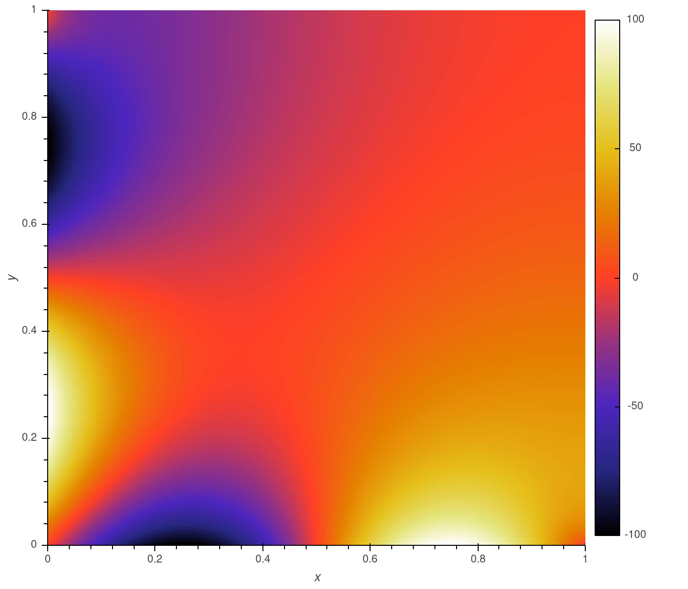
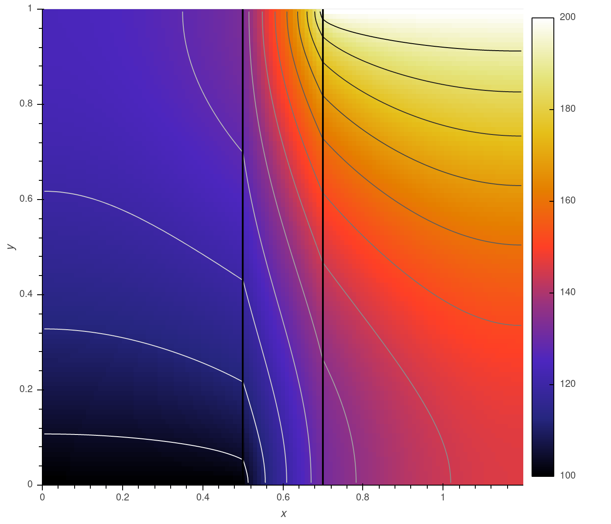
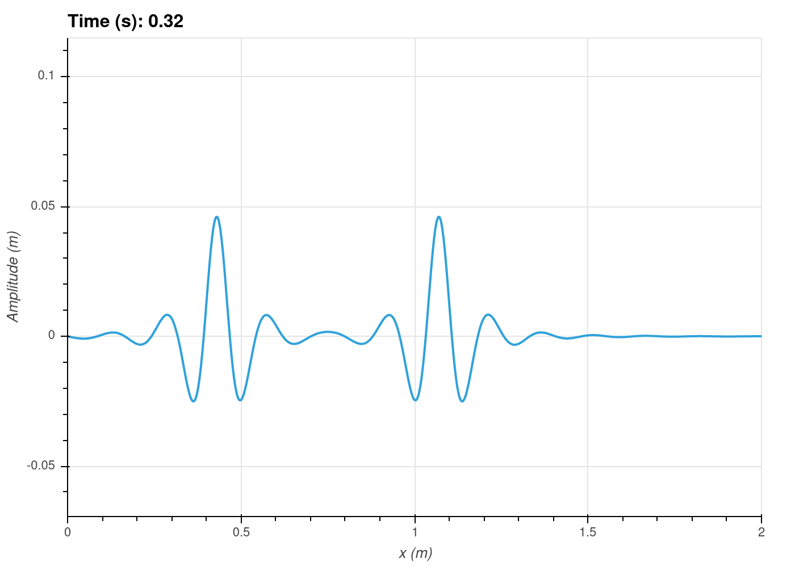
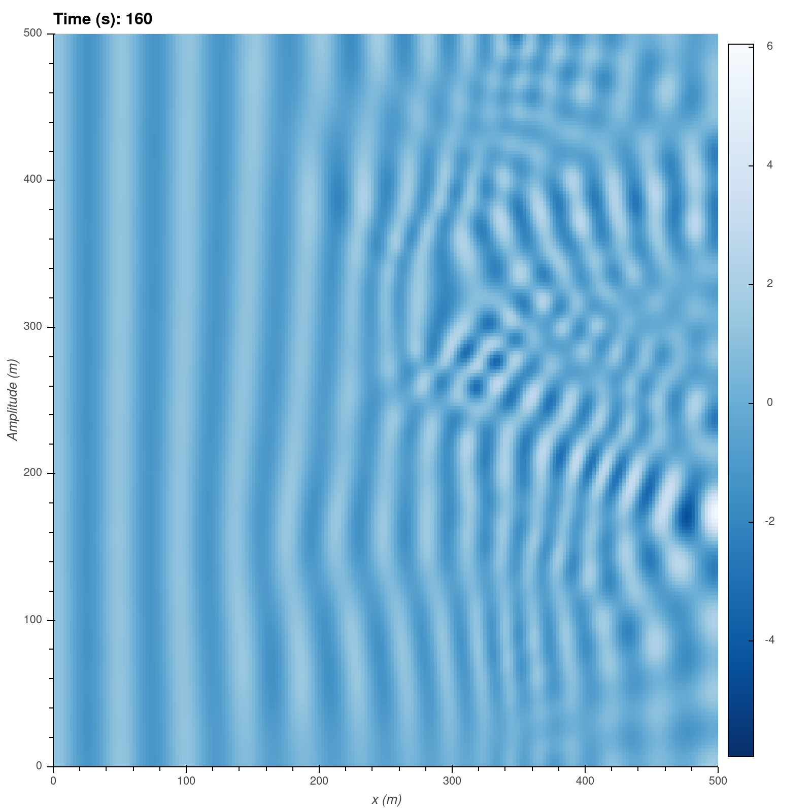

# FastFD
A finite differences simulation library.

This package lets you quickly build simple numerical simulations.

## Features
 * Quickly build finite difference simulations with an arbitrary number of domains, scalars, dimensions and boundary conditions.
 * Concise, clear syntax.
 * Build models for CPU or GPU using Scipy or Cupy sparse libraries.
 * Arbitrary derivative order and approximation accuracy.
 * Partial model updates minimize overheads in iterative solutions.
 * Implicit transient simulation.

## Usage
```python
# Import fastfd and select the scipy sparse library (or cupy for GPU support)
import fastfd as ffd
ffd.sparse_lib('scipy')

import numpy as np

# Define axes
x = ffd.LinearAxis('x', start = 0, stop = 1, num = 201)
y = ffd.LinearAxis('y', start = 0, stop = 1, num = 201)

# Define scalars
T = ffd.Scalar('T', [x, y], accuracy = 4)

# Define the model
model = ffd.FDModel([T])

# Set model governing equations (thermal diffusion)
model.update_equations({
    'Conductivity': ((T.d('x', 2) + T.d('y', 2)), 0),
})

# Set model boundary conditions
model.update_bocos({
    'Tx=1 adiabatic': (T.i[-1, :], T.d('x')[-1, :], 0),
    'Ty=1 adiabatic': (T.i[:, -1], T.d('y')[:, -1], 0),
    'Tx=0 sinewave': (T.i[0, :], T.i[0, :], 100 * np.sin(x.coords * 2*np.pi)),
    'Ty=0 sinewave': (T.i[:, 0], T.i[:, 0], -100 * np.sin(y.coords * 2*np.pi)),
})

# Solve the model
result = model.solve()

```
<p align="center">
    
</p>

## GPU
FastFD can be set to use the Cupyx sparse libraries, though support is still a little rough around the edges. The current
version of Cupy (8.5) only supports a least squares solver ('lsqr') which is much slower than the default 'spsolve'.
However, spsolve will be implemented in the upcoming release of Cupy 9.0.


## Example Notebooks
See example notebooks here: <a href="./docs/examples"> ./docs/examples </a> for a more detailed explanation of how to use.

  
