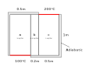
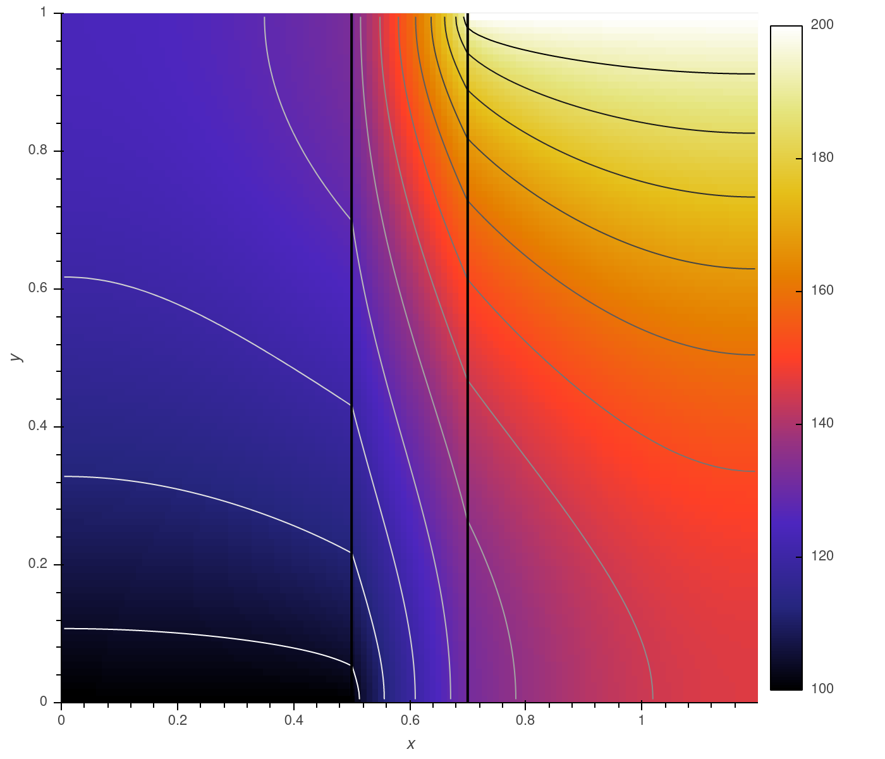

# FastFD
A finite differences simulation library.

This package lets you quickly build simple numerical simulations.

## Features
 * Quickly build finite difference simulations with an arbitrary number of domains, scalars, dimensions and boundary conditions.
 * Concise, clear syntax.
 * Build models for CPU or GPU using Scipy or Cupy sparse libraries.
 * Arbitrary derivative order and approximation accuracy.
 * Partial model updates minimize overheads in iterative solutions.
 * Implicit transient simulation 

## Usage
### Problem Description
2D thermal conduction through the three materials as depicted below.



To do this, the heat equation is solved for each domain:

$$
k \left(\frac{\partial^2 T}{\partial x^2} + \frac{\partial^2 T}{\partial y^2} \right) = 0 
$$

Several boundary conditions need to be satisfied:
 * An adiabatic boundary at x=0 is defined as: $\frac{\partial T_{x=0}}{\partial x} = 0$
 * An isothermal boundary setting y=0 to 100C is defined as: $T_{y=0} = 100$
 * To connect two boundaries, temperature and flux are equal: $Ta_{x=-1} -Tb_{x=0} = 0$ and $\frac{\partial Ta_{x=-1}}{\partial x} - \frac{\partial Tb_{x=0}}{\partial x} = 0$

### Import and Initialize
Import FastFD and select either scipy or cupy sparse libraries.
```python
import fastfd as ffd
ffd.sparse_lib('scipy')
```

### Define Model Domain
```python
# Linear axes define grid resolution in each dimension of the model
x_a = ffd.LinearAxis('x', start = 0, stop = 0.5, num = 51)
x_b = ffd.LinearAxis('x', start = 0.5, stop = 0.7, num = 21)
x_c = ffd.LinearAxis('x', start = 0.7, stop = 1.2, num = 51)
y = ffd.LinearAxis('y', start = 0, stop = 1, num = 101)

# Define scalars
# Axis names must be unique to each Scalar, but can be reused in different scalars.
# Default approximation accuracy can be set at the scalar level, or for individual derivitive calls
T_a = ffd.Scalar('T_a', [x_a, y], accuracy = 4)
T_b = ffd.Scalar('T_b', [x_b, y], accuracy = 4)
T_c = ffd.Scalar('T_c', [x_c, y], accuracy = 4)

# Define the model
# Scalar names must be unique within an FDModel
model = ffd.FDModel([T_a, T_b, T_c])
```

### Define Model Governing Equations and Boundary Conditions
```python
# Thermal Conductivity of domains a, b, and c
k_a = 3
k_b = 0.5
k_c = 1

# Set model governing equations (thermal diffusion)
# Equations are specied as a dictionary:
#     {'Key', (coefficient matrix, constraint vector)}
model.update_equations({
    'Cond A': (k_a * (T_a.d('x', 2) + T_a.d('y', 2)), 0),
    'Cond B': (k_b * (T_b.d('x', 2) + T_b.d('y', 2)), 0),
    'Cond C': (k_c * (T_c.d('x', 2) + T_c.d('y', 2)), 0),
})

# Set model boundary conditions
# Boundary conditions are specied as a dictionary with format:
#     {'Key', (mask, coefficient matrix, constraint vector)}
    
# Masks must be Scalar identites. Slices can be used selectively apply boundary conditions. Each
# mask and coefficient matrix must have the same shape.
model.update_bocos({
    'Ta(x=0) adiabatic': (T_a.i[0, :], T_a.d('x')[0, :], 0),
    'Ta(y=-1) adiabatic': (T_a.i[:, -1], T_a.d('y')[:, -1], 0),
    'Ta(y=0) temp': (T_a.i[:, 0], T_a.i[:, 0], 100),
    
    'Tb(y=0) adiabatic': (T_b.i[:, 0], T_b.d('y')[:, 0], 0),
    'Tb(y=-1) adiabatic': (T_b.i[:, -1], T_b.d('y')[:, -1], 0),
    
    'Tc(x=-1) adiabatic': (T_c.i[-1, :], T_c.d('x')[-1, :], 0),
    'Tc(y=0) adiabatic': (T_c.i[:, 0], T_c.d('y')[:, 0], 0),
    'Tc(y=-1) temp': (T_c.i[:, -1], T_c.i[:, -1], 200),
    
    '=flux Ta(x=-1) Tb(x=0)': (T_a.i[-1, :], k_a * T_a.d('x')[-1, :] - k_b * T_b.d('x')[0, :], 0),
    '= Ta(x=-1) Tb(x=0)': (T_b.i[0, :], T_a.i[-1, :] - T_b.i[0, :], 0),
    
    '=flux Tb(x=-1) Tc(x=0)': (T_c.i[0, :], k_b * T_b.d('x')[-1, :] - k_c * T_c.d('x')[0, :], 0),
    '= Tb(x=-1) Tc(x=0)': (T_b.i[-1, :], T_b.i[-1, :] - T_c.i[0, :], 0),
})

# Solve the model
result = model.solve()

result
```

```
{'T_a': array([[100.        , 100.38841668, 100.77670511, ..., 124.1795005, 124.18852596, 124.19153484],
        [100.        , 100.38848083, 100.77683328, ..., 124.1825072, 124.19153444, 124.19454392],
        ...,
        [100.        , 100.96773937, 101.7895391 , ..., 132.17201979, 132.19121735, 132.19762902],
        [100.30835348, 101.25835606, 102.06470249, ..., 132.54871166, 132.5688965 , 132.57563953]]),
 'T_b': array([[100.30835348, 101.25835606, 102.06470249, ..., 132.54871166, 132.5688965 , 132.57563953],
        [103.36366076, 103.57577554, 104.03423849, ..., 134.85551973, 134.88207261, 134.89095395],
        ...,
        [130.29065855, 130.29874523, 130.32296001, ..., 186.65114197, 188.20818963, 188.94947008],
        [131.48671749, 131.49430945, 131.51705206, ..., 190.85577689, 193.67966926, 197.27370348]]),
 'T_c': array([[131.48671749, 131.49430945, 131.51705206, ..., 190.85577689, 193.67966926, 197.27370348],
        [132.07335094, 132.08071976, 132.10279801, ..., 192.59871067, 195.74934077, 200.        ],
        ...,
        [145.76139301, 145.76699276, 145.78379182, ..., 198.07970988, 199.03961067, 200.        ],
        [145.7669927 , 145.77259235, 145.78939113, ..., 198.08019725, 199.03985471, 200.        ]])}
```

### Plot Results
```python
import numpy as np
import holoviews as hv
hv.extension('bokeh')

Image = hv.Image(
    np.hstack([result['T_a'].T, result['T_b'][1:-1,:].T, result['T_c'].T])[::-1,:],
    bounds = (0, 0, 1.2, 1)
).opts(
    cmap = 'CMRmap',
    colorbar = True
)

hv.Overlay([
    Image,
    hv.operation.contours(Image, levels = 15).opts(cmap = 'gray_r'),
    hv.Curve(((0.5, 0.5), (0, 1))).opts(color = 'k'),
    hv.Curve(((0.7, 0.7), (0, 1))).opts(color = 'k'),
]).opts(
    width = 700, height = 600,
    show_legend = False
)
```
.

## Partial Updates
Partial updates to the model can significantly speed up solution times on iterative problems. For example, if only one boundary
condition is updated each iteration, only it needs to be passed to `FDModel.update_bocos()`. Further speedup is possible by passing
`None` for values that are to be reused.

Building on the example above, the following method would only update the cold temperature specified at y=0 in domain a.

```python
def iteration(T_cold):
    model.update_bocos({
        'Ta(y=0) temp': (None, None, T_cold),
    })
    
    return model.solve()
```

## GPU
FastFD can be set to use the Cupyx sparse libraries. The current version of Cupy (8.5) only supports a least squares
solver ('lsqr') which is much slower than the default 'spsolve'. Currently, 'scipy' is faster than 'cupy' on a Ryzen 9 3900X
with an RTX 2080Ti, running on CPU is faster than GPU. However, spsolve will be implemented in the upcoming release of Cupy 9.0

## Solution Coordinates
Meshgrid coordinates matching the solution format are available using `FDModel.coords`
